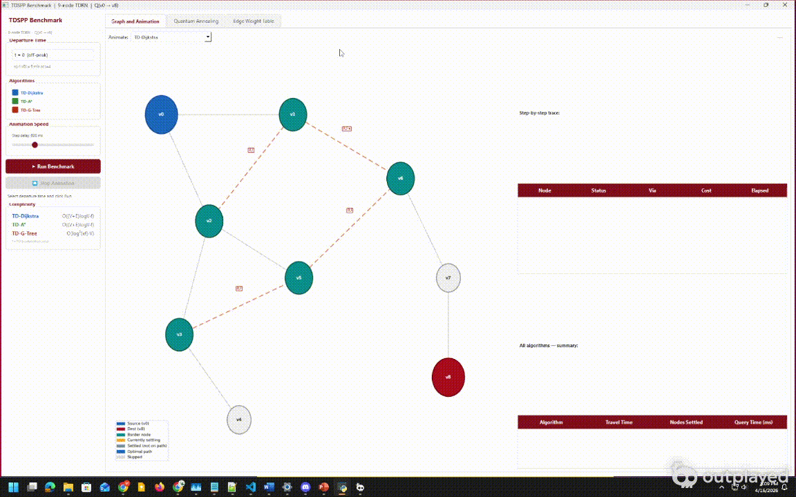
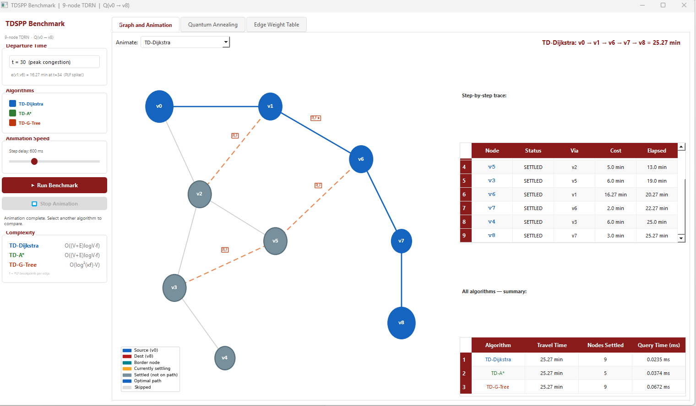
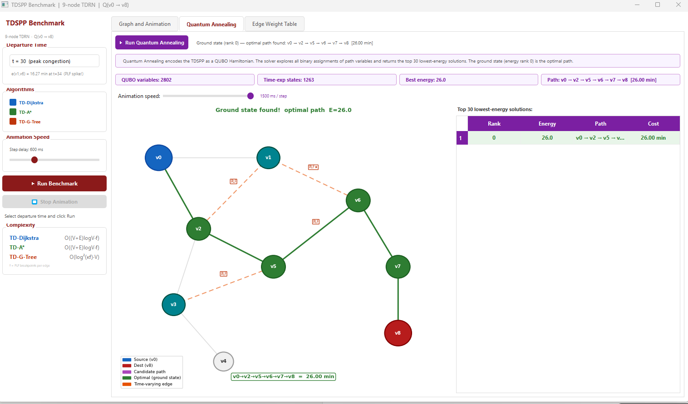

# Shortest Paths with Changing Edge Weights

Group 2 — CS 570 Algorithm Design and Analysis
 Md Nazmul Hoque, Muhammad Jahanzeb Khan, Hassan Mahmoud
University of Alabama

---

## Demo



---

## What This Project Does

This project benchmarks three classical algorithms and one quantum annealing formulation for the Time-Dependent Shortest Path Problem (TDSPP) — finding the fastest route between two nodes in a road network where edge costs change over time depending on when you travel.

The key difference from a regular shortest path problem: the cost of an edge is not a fixed number. It is a piecewise linear function of the time you arrive at that edge. Leave later and the same road might be faster or slower depending on traffic conditions at that moment.

The quantum annealing approach encodes the problem as a QUBO (Quadratic Unconstrained Binary Optimization) and uses the D-Wave Ocean SDK to find the ground state, which corresponds to the optimal path. This serves as a proof-of-concept for applying quantum annealing to time-dependent routing problems.

---

## Project Structure

```
├── algorithms/
│   ├── __init__.py              registers all algorithms
│   ├── graph.py                 graph data structure and PLF evaluation
│   ├── td_dijkstra.py           TD-Dijkstra (baseline)
│   ├── td_astar.py              TD-A* (heuristic-guided)
│   ├── td_g_tree.py             TD-G-Tree (index-based)
│   └── quantum_annealing.py     QUBO formulation via D-Wave Ocean SDK
│
├── benchmark.py                 terminal benchmark, prints full results table
├── gui.py                       PyQt5 GUI with animated graph and quantum tab
├── figures/
│   ├── Project-Demo.gif         demo animation of the GUI
│   ├── Project-Demo.mp4         demo video
│   ├── quantum-t30.png          quantum annealing result at t=30
│   └── td-dijkstra-t30.png      TD-Dijkstra trace at t=30
└── README.md
```

---

## The Graph

A 9-node time-dependent road network with 11 bidirectional edges. Four edges have time-varying costs, seven are fixed.

```
Nodes: v0 through v8
Source: v0
Destination: v8
```

| Edge | PLF Breakpoints | Type |
|---|---|---|
| e(v0, v1) | (0,4), (60,4) | Fixed |
| e(v0, v2) | (0,8), (60,8) | Fixed |
| e(v1, v2) | (0,8), (20,8), (35,20), (60,20) | Time-varying |
| e(v1, v6) | (0,5), (20,5), (30,18), (60,5) | Time-varying — spikes at t=30 |
| e(v2, v3) | (0,15), (60,15) | Fixed |
| e(v2, v5) | (0,5), (60,5) | Fixed |
| e(v3, v4) | (0,6), (60,6) | Fixed |
| e(v3, v5) | (0,22), (20,22), (35,6), (60,6) | Time-varying |
| e(v5, v6) | (0,8), (25,8), (45,12), (60,12) | Time-varying |
| e(v6, v7) | (0,2), (60,2) | Fixed |
| e(v7, v8) | (0,3), (60,3) | Fixed |

Between breakpoints, costs are linearly interpolated. For example, e(v1,v6) at t=34 falls between (30,18) and (60,5), giving 18 + (34-30) x (5-18)/(60-30) = 16.27 min.

Three departure times are tested: t=0 (off-peak), t=30 (peak congestion), t=50 (recovering).

---

## Algorithms

### TD-Dijkstra

Dreyfus, 1969. The baseline exact algorithm. Works like standard Dijkstra except edge costs are evaluated at the actual arrival time at each node, not the original departure time. Always picks the node reachable in the least time and expands from there.

Complexity: O((V + E) log V · f) where f = max PLF breakpoints per edge.

### TD-A*

Zhao et al., 2008. Same as TD-Dijkstra but adds a precomputed lower-bound heuristic h(v) for every node — the minimum possible remaining time to the destination. This steers the search toward the destination and skips nodes going the wrong way. Because h(v) never overestimates, the result is still exact.

Heuristic values: v8=0, v7=3, v6=5, v1=7, v5=13. Nodes v3 and v4 are pruned entirely.

Complexity: O((V + E) log V · f) — same asymptotic, fewer nodes settled in practice.

### TD-G-Tree

Wang, Li, Tang — PVLDB 2019. Index-based algorithm. The graph is split into clusters offline. Border nodes (nodes whose edges cross cluster boundaries) are identified and travel times between all border pairs are precomputed. At query time, only border nodes are touched.

Our graph uses 4 clusters:

| Cluster | Nodes | Border nodes |
|---|---|---|
| Source cluster | v0, v1, v2 | v1, v2 |
| Destination cluster | v6, v7, v8 | v6 |
| Bottom cluster | v3, v4 | v3 |
| Connector | v5 | v5 |

`local_dijkstra` is an inherent part of the algorithm: since source v0 and destination v8 are not border nodes themselves, a short Dijkstra restricted to one cluster is needed to travel between them and the cluster border nodes.

Complexity: O(log^2(kf) · V · log^2 f) per query.

### Quantum Annealing

D-Wave Ocean SDK, QUBO formulation. Encodes the TDSPP as a Quadratic Unconstrained Binary Optimization problem. One binary variable per transition in the time-expanded graph. The full Hamiltonian is:

```
H_P = H_cost + A * H_source + A * H_dest + A * H_flow
```

where A = 100 satisfies A > max edge cost = 30, guaranteeing constraint feasibility.

Edge costs in the QUBO are evaluated using a step function. This is a discrete approximation of the PLF — costs are exact only when arrival times coincide with PLF breakpoints. Between breakpoints the step function holds the previous breakpoint value, which can cause the solver to select a different path than the classical algorithms. See the Known Limitation section below.

---

## Results

### Classical Algorithms

All three find the same optimal path for all departure times.

| | t = 0 | t = 30 | t = 50 |
|---|---|---|---|
| TD-Dijkstra | 14.00 min | 25.27 min | 16.60 min |
| TD-A* | 14.00 min | 25.27 min | 16.60 min |
| TD-G-Tree | 14.00 min | 25.27 min | 16.60 min |

Path for all three departure times: v0 → v1 → v6 → v7 → v8

At t=30, you arrive at v1 at t=34. The PLF at t=34 gives e(v1,v6) = 16.27 min (linear interpolation between breakpoints (30,18) and (60,5)). The alternative route via v2→v5→v6 costs 8+5+11.6 = 24.6 min just to reach v6, making the direct route still faster.



### Quantum Annealing

The QUBO uses the step function approximation, which evaluates costs at breakpoint values rather than interpolating.

| | t = 0 | t = 30 | t = 50 |
|---|---|---|---|
| Path | v0→v1→v6→v7→v8 | v0→v2→v5→v6→v7→v8 | v0→v1→v6→v7→v8 |
| Cost | 14 min | 26 min | 27 min |

At t=30 the quantum solver selects v0→v2→v5→v6→v7→v8 (26 min) instead of the classical optimal (25.27 min). The step function evaluates e(v1,v6) at arrival time t=34 as 18 min (holding the breakpoint value at t=30), whereas the correct interpolated value is 16.27 min. The inflated cost makes the v2→v5 route appear cheaper.

At t=50 the quantum solver gives 27 min versus the classical 16.6 min. The step function at t=54 returns 18 min for e(v1,v6) (still past the t=30 breakpoint), whereas the correct interpolated value is 7.6 min.



---

## Nodes Visited Comparison

| | t = 0 | t = 30 | t = 50 |
|---|---|---|---|
| TD-Dijkstra | v0, v1, v2, v6, v7, v5, v8 | all 9 nodes | v0, v1, v2, v6, v5, v7, v8 |
| TD-A* | v0, v1, v6, v7, v8 | v0, v1, v6, v7, v8 | v0, v1, v6, v7, v8 |
| TD-G-Tree | skips v3, v4, v5 | skips v4 | skips v3, v4 |

---

## Algorithm Complexity

| Algorithm | Formula | On our graph (V=9, E=11, f=4) |
|---|---|---|
| TD-Dijkstra | O((V+E) log V · f) | ~254 operations |
| TD-A* | O((V+E) log V · f) | ~141 in practice (5 nodes settled) |
| TD-G-Tree | O(log^2(kf) · V · log^2 f) | ~324 (advantage appears at scale) |
| Quantum (QUBO) | O(|E| · |T|) variables | 26 transitions at t=0, 27 at t=30 |

TD-G-Tree looks more expensive on 9 nodes because its advantage only appears on large networks with many repeated queries.

---

## Quantum Annealing — Known Limitation

The QUBO formulation requires discrete costs. The step function approximation of the PLF evaluates edge costs by holding the value at the last breakpoint, overestimating costs at non-breakpoint arrival times. This is the fundamental tension between the continuous PLF model and the discrete QUBO encoding.

At t=0 the quantum result matches the classical result because arrival times fall on PLF flat zones where the step function is accurate. At t=30 and t=50 the approximation error causes the solver to select a different path than the classical algorithms.

Resolving this would require either finer time discretization (more QUBO variables proportional to |E| x |T|) or a piecewise-linear cost encoding using auxiliary binary variables, significantly increasing problem size and making the formulation harder to embed on current quantum hardware.

---

## How to Run

### Requirements

```
PyQt5
matplotlib
numpy
dimod
dwave-samplers
```

Install with:

```bash
pip install PyQt5 matplotlib numpy dimod dwave-samplers
```

### Terminal Benchmark

```bash
python benchmark.py
```

Prints the full results table for classical algorithms and quantum annealing at t=0, t=30, t=50. The quantum section shows the top energy-ranked solutions with decoded paths and a marker on the ground state.

### GUI

```bash
python gui.py
```

The GUI has three tabs.

The Graph and Animation tab runs the classical algorithms and animates node settlement one step at a time. Each node lights up as it is settled, showing cost and elapsed time in the trace table on the right. Use the algorithm dropdown to switch between TD-Dijkstra, TD-A*, and TD-G-Tree and compare how many nodes each one visits.

The Quantum Annealing tab runs the QUBO solver and animates through the top energy-ranked solutions on the graph. Each candidate path is drawn in purple as the solver explores the energy landscape. When the ground state (rank 0) is reached, the path locks in green and the animation stops.

The Edge Weight Table tab shows the full PLF breakpoint table from the experiment.

---

## References

Wang, Y., Li, G., and Tang, N. (2019). Querying Shortest Paths on Time Dependent Road Networks. PVLDB, 12(11), 1249-1261.

Zhao, X. et al. (2008). Time-dependent heuristic search for routing in dynamic road networks.

Dreyfus, S. E. (1969). An appraisal of some shortest-path algorithms. Operations Research, 17(3), 395-412.

Papalitsas, C. et al. (2019). A QUBO model for the traveling salesman problem with time windows. Algorithms, 12(11), 224.

Krauss, T. and McCollum, J. (2020). Solving the network shortest path problem on a quantum annealer. IEEE Transactions on Quantum Engineering, 1, 1-12.